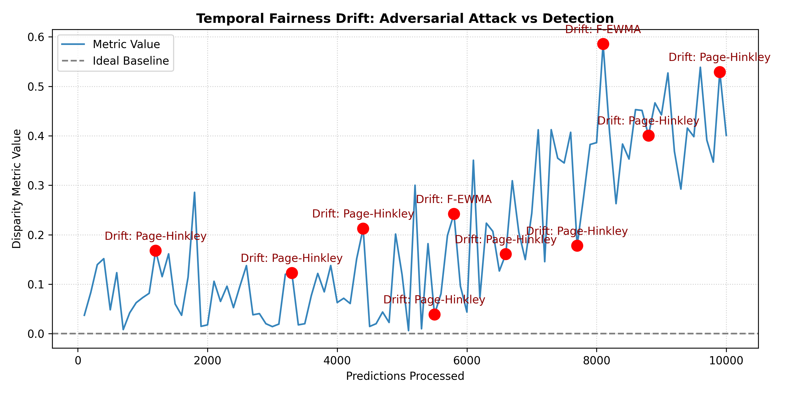

# Temporal Fairness Drift Monitor ⚖️📈

A scalable, mathematically rigorous, and computationally efficient orchestration engine for monitoring automated temporal fairness drift in machine learning models running in production environments.

> This project addresses the **"Point-in-Time Audit Fallacy"**: the dangerous industry standard of testing AI models for fairness only *once* before deployment. It continuously tracks streaming predictions to ensure deployed models do not implicitly learn biased behavior due to natural demographic shifts (covariate drift) or adversarial data poisoning.

---

## 🎯 The Problem

When a machine learning model or LLM is audited for compliance, it is validated on a static, historical dataset. If it achieves a Demographic Parity (DP) or Equal Opportunity (EO) differential within acceptable margins, it is deployed.

However, in real-world production systems:
1. **Natural Drift:** Macroeconomic changes, shifting user demographics, and seasonality alter the underlying distribution.
2. **Data Poisoning:** Adversarial agents intentionally feed a model biased feedback, systematically shifting its behavior. 

Current orchestration platforms detect simple accuracy drift, but *Fairness Drift* requires comparing multi-variable demographic ratios dynamically over time without utilizing memory-bloated storage solutions or naive thresholds.

---

## 🚀 The Solution: The "Detection Triangle"

This architecture eliminates arbitrary fixed-window parameters ("duct-tape" sliding windows) by employing a mathematically rigorous **Detection Triangle**. It processes prediction streams in statistical micro-batches, resulting in zero-state memory bloat (*O(1) continuous complexity* using Welford's online algorithm):

1. **F-ADWIN (Adaptive Windowing):** Dynamically scales its evaluation window to catch sudden, large-scale categorical shifts using Hoeffding bounds.
2. **F-EWMA (Exponentially Weighted Moving Average):** Utilizes historical exponential dampening to specifically detect "slow-burn" adversarial data accumulation before it breaches absolute compliance thresholds.
3. **Page-Hinkley:** Detects continuous monotonic degradation (zig-zagging fairness drops).

All detections are strictly evaluated with returning $p$-values and confidence margins via a FastAPI integration.

---

## 📊 Benchmark Results (COMPAS & Adversarial Simulations)

The framework has been benchmarked against both structured adversarial data-poisoning attacks and real-world proxy architectures based on the COMPAS recidivism datasets.

*   When subjected to a 3,000-step linear bias injection attack at `t=5000`, industry-standard naive sliding windows suffered a detection latency of **1,406 steps**.
*   The **F-EWMA & Page-Hinkley Orchestrator** definitively identified the statistical trend shift in **499 steps**, operating **64.5% faster** while maintaining zero false positives during the stabilization phase.



---

## 🛠️ Architecture & Quickstart

### Installation & API
The system is built as an independent, lightweight Python package integrating a FastAPI endpoint to ingest real-time predictions from any live AI agent.

```bash
# Clone and setup
git clone https://github.com/Shaw1011/fairness-drift.git
cd fairness-drift
python -m venv venv
source venv/bin/activate  # or `.\venv\Scripts\activate` on Windows
pip install -r requirements.txt

# Start the continuous monitor
uvicorn api.routes:app --reload
```

### Ingesting Predictions (Real-time)
Send a simple JSON payload to the `/ingest` endpoint representing the model's prediction:
```json
// POST /api/v1/drift/ingest
{
    "y_true": 1,
    "y_pred": 0,
    "sensitive_attr": "African-American"
}
```
If the event triggers a statistically significant drift in demographic parity or equal opportunity, returning JSON payloads will alert engineers immediately with precise onset estimates.

### Run Benchmarks Locally
Replicate the paper's benchmarks and automatically generate the evaluation graphs inside `paper/figures/`:
```bash
# Adversarial Data Poisoning Simulation
python benchmarks/synthetic_drift.py

# COMPAS Real-world Retrospective Simulation
python benchmarks/compas_simulation.py
```
